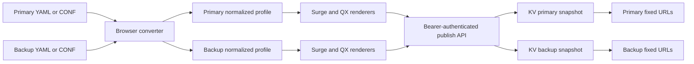

# Architecture

## Responsibility boundaries



### Browser

- Owns untrusted text parsing, schema validation, format detection, normalization, rendering, and human-readable warnings.
- Exposes independent primary and backup upload slots. Each slot accepts one Clash YAML or Surge CONF and can be updated without replacing the other slot.
- Holds `ADMIN_TOKEN` only in React component state and sends it as a Bearer credential; it is never written to browser storage.
- Publishes the selected slot, source text, both rendered outputs, conversion stats, and warnings as one JSON payload.

### Worker

- Owns management authorization, request limits, structural output checks, digests, per-slot snapshot publication, and subscription distribution.
- Validates Bearer `ADMIN_TOKEN` for status and publication requests.
- Does not parse YAML or reinterpret client conversion results.
- Keeps routing in `worker/index.ts`; HTTP, auth, validation, and KV behavior are separate modules under `worker/lib/` and `worker/routes/`.

### Workers KV

Each slot is stored as one independent JSON value:

```text
profile:current = { metadata, source, surge, quanx }  # primary
profile:backup  = { metadata, source, surge, quanx }  # backup
```

Using one key per slot keeps each published profile internally complete. Updating backup does not replace primary and vice versa. KV is eventually consistent, so another region may briefly serve the previous complete version of that slot after a publish, but readers never resolve a half-written profile. Only the latest snapshot in each slot is retained.

## Conversion model

Both input formats map to:

- `ProxyNode`
- `PolicyGroup`
- `RoutingRule`
- `GeneralSettings`

Renderers depend only on that model. Adding another source format requires a new adapter; adding another target requires a new renderer. There are no direct Clash-to-QX or Surge-to-QX cross-module dependencies.

Surge input additionally retains `rawSource`. The Surge renderer returns it unchanged, preserving sections that do not belong in the normalized cross-platform model.

## URL compatibility

The original URLs remain the primary slot:

```text
/sub/surge.conf?p=<SUBSCRIPTION_TOKEN>
/sub/quanx.conf?p=<SUBSCRIPTION_TOKEN>
```

Backup uses a separate stable prefix:

```text
/sub/backup/surge.conf?p=<SUBSCRIPTION_TOKEN>
/sub/backup/quanx.conf?p=<SUBSCRIPTION_TOKEN>
```

All four URLs share `SUBSCRIPTION_TOKEN`; changing the token rotates every subscription URL.

## Security model

- `ADMIN_TOKEN` protects status and publication APIs and is entered in the browser management UI for the current page session.
- `SUBSCRIPTION_TOKEN` is supplied as `p` on all fixed subscription URLs.
- Secret comparisons hash both values with SHA-256 before `crypto.subtle.timingSafeEqual`.
- Invalid subscription paths and tokens return the same `404` response.
- Static assets use a restrictive CSP and no third-party resources.
- Subscription responses use `Cache-Control: private, no-store` and `X-Robots-Tag`.
