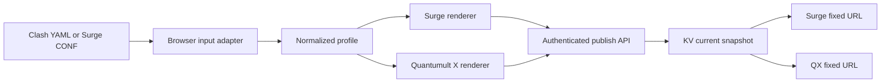

# Architecture

## Responsibility boundaries



### Browser

- Owns untrusted text parsing, schema validation, format detection, normalization, rendering, and human-readable warnings.
- Holds the management token only in React component state.
- Publishes source text, both rendered outputs, conversion stats, and warnings as one JSON payload.

### Worker

- Owns authorization, request limits, structural output checks, digests, snapshot publication, and subscription distribution.
- Does not parse YAML or reinterpret client conversion results.
- Keeps routing in `worker/index.ts`; HTTP, auth, validation, and KV behavior are separate modules under `worker/lib/` and `worker/routes/`.

### Workers KV

A published profile is stored as one JSON value:

```text
profile:current = {
  metadata,
  source,
  surge,
  quanx
}
```

Using one key keeps each published snapshot internally complete. KV is eventually consistent, so another region may briefly serve the previous complete snapshot after a publish, but readers never resolve a new pointer to missing content. Only the latest snapshot is retained.

## Conversion model

Both input formats map to:

- `ProxyNode`
- `PolicyGroup`
- `RoutingRule`
- `GeneralSettings`

Renderers depend only on that model. Adding another source format requires a new adapter; adding another target requires a new renderer. There are no direct Clash-to-QX or Surge-to-QX cross-module dependencies.

Surge input additionally retains `rawSource`. The Surge renderer returns it unchanged, preserving sections that do not belong in the normalized cross-platform model.

## Security model

- `ADMIN_TOKEN`: Bearer token for status and publication.
- `SUBSCRIPTION_TOKEN`: shared high-entropy value supplied as `p` on both fixed subscription URLs.
- Secret comparison uses `crypto.subtle.timingSafeEqual` after equal-length checks.
- Invalid subscription paths and tokens return the same `404` response.
- Static assets use a restrictive CSP and no third-party resources.
- Subscription responses use `Cache-Control: private, no-store` and `X-Robots-Tag`.

The query token remains a credential. Moving it from a path to `p` improves URL shape but does not replace entropy; short values such as `ny` are intentionally unsupported by deployment guidance.
