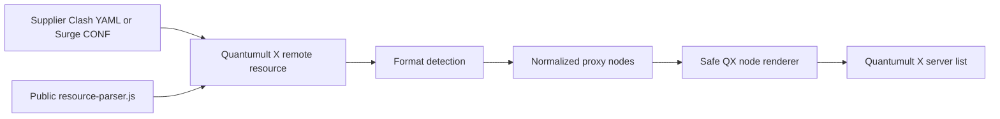
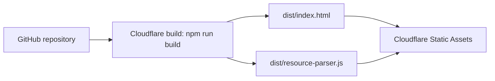

# Architecture

## Data flow

The supplier profile and parser script are downloaded independently by Quantumult X. Conversion runs inside the client; Cloudflare serves only immutable project assets and never receives the supplier profile through this application.

## Module boundaries

### Source adapters

`parse-clash.ts` parses YAML with bounded aliases and adapts the top-level `proxies` array. `parse-surge.ts` scans only `[Proxy]`, using a quote-aware comma splitter so unrelated Surge configuration is ignored.

Both adapters produce `ProxyNode` values from `model.ts` and warnings for individual unsupported or malformed nodes. They do not render output.

### Conversion orchestration

`index.ts` owns content-based format detection, the 5 MB/5000-node limits, information-node filtering, renderer error isolation, aggregate statistics, and terminal errors when no node can be converted.

### QX renderer

`render.ts` maps normalized nodes to one Quantumult X line per node. It formats IPv6 endpoints, preserves representable TLS/SNI/transport options, and rejects comma/newline field injection before joining output.

### Runtime and build

`resource-parser.ts` is a thin adapter around Quantumult X globals:

- reads `$resource.content`;
- optionally reports skipped nodes through `$notify`;
- returns `{ content }` through `$done`;
- catches parsing failures and returns empty content.

`scripts/build.mjs` uses esbuild to bundle this entry and `yaml` into a single ES2020 IIFE, then copies the static documentation assets into `dist/`.

## Deployment

`wrangler.jsonc` intentionally has an `assets.directory` and no `main`. There are no API routes, Durable Objects, KV/R2/D1 bindings, service bindings, environment variables, or secrets.

## Security properties

- The hosted script is public code and contains no proxy credentials.
- Supplier content is processed by Quantumult X, not submitted to this Cloudflare project.
- Unsafe comma/newline values cannot create extra QX fields or lines.
- Source size, YAML alias expansion, and node count are bounded.
- Static responses set a restrictive CSP, disable MIME sniffing, and allow cross-origin loading of the parser script.
