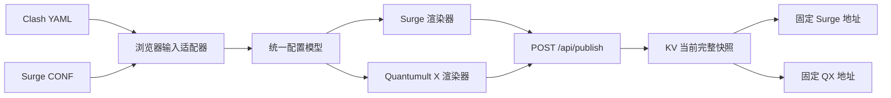

# AI Handoff

> 这是新 AI 对话的首要入口。开始任何工作前，先读完本文件，再读取 `doc/current-state.md` 和相关架构文档。本文是当前快照，不是按时间追加的变更日志；发现内容过期时应直接修正或删除旧结论。

## 1. 项目身份与工作目录

当前实现不是最初打开的 `img-list` 项目，而是一个新建的独立项目：

```text
/Users/niyangup/WorkSpace/WebStormProjects/proxy-profile-service
```

项目名称：`Proxy Profile Service`。

目标：用户每次从供应方拿到最新 Clash YAML 或 Surge CONF 后，可以在手机或电脑浏览器上传，服务生成并长期提供两个固定远程地址：

```text
https://<domain>/sub/surge.conf?p=<SUBSCRIPTION_TOKEN>
https://<domain>/sub/quanx.conf?p=<SUBSCRIPTION_TOKEN>
```

不要误改 `/Users/niyangup/WorkSpace/WebStormProjects/img-list`。后续实现、测试、部署和文档维护都应在 `proxy-profile-service` 中完成。

## 2. 用户已经确认的需求

- 服务必须部署到 Cloudflare，不能依赖身边有 Mac 或本地常驻进程。
- 上传页面应适合手机浏览器使用。
- 输入支持 Clash YAML 和 Surge CONF，并按内容自动识别，而不是只看扩展名。
- 浏览器负责解析和转换；Worker 只负责鉴权、轻量复核、存储与分发。
- 输出是 Surge 和 Quantumult X 两个固定地址；每次上传新文件后地址不能变化。
- 上传由 `ADMIN_TOKEN` 保护。
- 两个订阅地址共用一个 `SUBSCRIPTION_TOKEN`，通过查询参数 `p` 传递。
- `p` 必须是至少 32 字节密码学随机数据的 Base64URL 值，不能使用 `ny` 之类可猜短值。
- 服务不使用第三方订阅转换接口，不把节点凭据发送给无关第三方。
- 生产 KV、Secrets 和部署只能在用户明确要求后执行。KV 由 Wrangler 在首次部署时自动创建，不需要 R2。

## 3. 最重要的最新结论

**当前 WestData 供应方应优先上传 Clash YAML。**

真实文件只读验证结果：

- `/Users/niyangup/Downloads/westData2.yaml`
  - 61 个可用节点
  - 21 个策略组
  - 4232 条展开规则
  - QX 跳过 32 条 iOS 不适用的进程规则
  - 移除 2 个流量/到期信息节点
- `/Users/niyangup/Downloads/WestData-expanded.conf`
  - 61 个可用节点
  - 21 个策略组
  - 只有 9 条可直接移植的本地规则
  - 其余主要是 Surge 专属远程 `RULE-SET`，不能安全机械转换为 QX 本地规则
  - `Host`、Rewrite、MITM、Script 等 Surge 专属段不会进入 QX

早期计划曾出现“两个文件都有时优先 Surge”的结论，**该结论已经被真实运行证据推翻，不应继续执行**。当前规则是：

1. 有 YAML 时上传 YAML，Surge 和 QX 都获得完整展开规则。
2. 只有 CONF 时才上传 CONF；Surge 输出保持原文件，QX 获得节点、策略和可移植规则，并显示缺失警告。

## 4. 当前架构



职责边界：

- 浏览器：不可信文本解析、格式检测、限制校验、统一模型、双目标渲染、警告预览。
- Worker：令牌校验、请求大小限制、产物结构复核、SHA-256、KV 快照发布、订阅读取。
- KV：用一个 `profile:current` 值保存元数据、原文和两份输出；失败写入不会替换当前快照，跨地区最多短暂读到上一版完整快照。

详细架构见 `doc/architecture/overview.md`。

## 5. 已完成实现

### 浏览器转换

核心目录：`src/features/converter/`

- `model.ts`：`ProxyNode`、`PolicyGroup`、`RoutingRule`、`NormalizedProfile` 等统一模型。
- `clash/parseClashProfile.ts`：安全解析 Clash YAML，限制别名、大小和集合数量。
- `surge/parseSurgeProfile.ts`：按配置段扫描 Surge，避免通用 INI 解析器破坏正则和含等号值。
- `renderers/renderSurgeProfile.ts`：生成 Surge 完整配置；Surge 输入时返回原文件。
- `renderers/renderQuanxProfile.ts`：生成 QX 的 `[general]`、`[dns]`、`[policy]`、`[server_local]`、`[filter_local]`。
- `index.ts`：格式检测和完整转换流水线。

当前故意只支持真实样本需要的 Trojan 节点与 `select` 策略组。遇到未知关键协议或策略类型时阻止发布，不能静默丢弃。

### 上传界面

核心文件：`src/features/uploader/ProfileUploader.tsx`

- 管理令牌只保存在 React 本地状态，不进入 `localStorage`。
- 选择文件后在浏览器转换并显示节点、策略、规则、跳过项和警告。
- 移动端布局已实现。
- 页面不加载第三方脚本、字体或统计资源。

### Worker API

入口：`worker/index.ts`

- `GET /api/health`：公开健康检查。
- `GET /api/status`：需要 Bearer `ADMIN_TOKEN`。
- `POST /api/publish`：需要 Bearer `ADMIN_TOKEN`。
- `GET /sub/surge.conf?p=...`：需要正确 `SUBSCRIPTION_TOKEN`。
- `GET /sub/quanx.conf?p=...`：需要正确 `SUBSCRIPTION_TOKEN`。

关键模块：

- `worker/lib/auth.ts`：使用 `crypto.subtle.timingSafeEqual` 比较令牌。
- `worker/lib/validation.ts`：限制与产物必要段复核。
- `worker/lib/storage.ts`：摘要、KV 当前快照读写和订阅地址。
- `worker/routes/publish.ts`：将完整产物作为一个 KV 快照写入。
- `worker/routes/subscription.ts`：读取 KV 快照目标内容、支持基于 SHA-256 的 `ETag`、禁止公共缓存和索引。

缺失或错误的订阅令牌统一返回 `404`，不暴露地址是否存在。

## 6. 数据与安全边界

- 真实 YAML、CONF、节点密码、MITM 证书和生产令牌不得写入仓库、测试 fixture、文档或日志。
- `/Users/niyangup/Downloads/WestData-expanded.conf` 包含代理密码、MITM `ca-p12` 和证书口令，读取时视为敏感输入，禁止在回答或命令输出中复述。
- `.dev.vars` 已被 Git 忽略，只包含本地开发占位值；生产令牌必须通过 `wrangler secret put` 设置。
- `SUBSCRIPTION_TOKEN` 是凭据。改成查询参数只是 URL 形态变化，安全性仍依赖随机强度。
- Surge Script、MITM、Rewrite、Map Local、SSID 和远程 `RULE-SET` 不应假装兼容 QX。
- KV 只保留最新完整快照，不保留历史版本；这是为了适配免费额度并避免多键最终一致造成半发布状态。

## 7. 已完成验证

最近完整验证全部通过：

```text
npm run format
npm run lint
npm run typecheck
npm test
npm run build
npm run deploy:dry-run
```

测试基线：

- 前端：2 个测试文件，共 5 个测试通过。
- Worker：1 个测试文件，共 3 个测试通过。
- 真实 WestData YAML 和 CONF 已进行只读烟雾转换，只输出统计与警告，没有输出凭据或派生产物。
- Wrangler dry-run 已确认 Worker Static Assets 和 `PROFILE_STORE` KV binding 能正确打包。

## 8. 当前部署状态

尚未进行：

- 配置生产 `ADMIN_TOKEN`。
- 配置生产 `SUBSCRIPTION_TOKEN`。
- 实际部署 Worker。
- 在真实 Surge 和 Quantumult X 中导入并验证两个远程地址。

首次部署步骤记录在 `README.md`。除非用户明确要求部署，否则只能执行 `npm run deploy:dry-run`，不能运行 `npm run deploy`。

## 9. 新 AI 接手顺序

1. 将工作目录切换到 `/Users/niyangup/WorkSpace/WebStormProjects/proxy-profile-service`。
2. 读取本文件。
3. 读取 `doc/current-state.md`，确认验证基线和部署状态没有变化。
4. 涉及模块边界时读取 `doc/architecture/overview.md`。
5. 涉及操作或部署时读取 `README.md` 和 `wrangler.jsonc`。
6. 修改行为、配置或依赖后，同步更新 `doc/current-state.md`；修改职责、接口、数据流或部署行为后同步更新架构文档和本 handoff。
7. 不要根据旧聊天计划覆盖当前运行证据，不要修改无关项目，不要提交或部署，除非用户明确要求。

## 10. 每次对话的强制收尾协议

每次 AI 对话结束前，无论是否准备提交代码，都必须执行一次文档状态检查：

1. 检查本次对话是否改变了代码、配置、依赖、接口、模块职责、数据流、安全决策、部署状态、验证结果、风险或下一步。
2. 有变化时，必须在同一对话内更新 `doc/handoff.md` 和对应的当前状态文档，不能把更新留给下一次对话。
3. 行为、配置、依赖、验证基线、部署状态和待处理事项更新到 `doc/current-state.md`。
4. 架构、接口、模块职责、状态所有权、数据流或部署行为更新到 `doc/architecture/`。
5. `doc/handoff.md` 必须同步保留新对话真正需要知道的目标、最新决策、过期结论纠正、当前阻塞和下一步。
6. 只记录实际执行过的验证；不能提前把未运行的检查写成通过。
7. 用最新结论替换或删除旧结论，不按日期追加对话流水账，也不保留已失效的方案。
8. 如果本次只是问答且没有改变任何项目事实，不伪造“修改记录”；仍需确认现有 handoff 没有因对话中的新决策而过期。
9. 向用户结束回复前，确认上述文档已保存且内容与运行时证据一致。

这是一项持续维护约束，不是一次性文档任务。任何新 AI 接手后都必须继续执行。

## 11. 下一步

当前实现已经完成且 dry-run 通过。最自然的下一步是用户明确授权后：

1. 登录 Cloudflare。
2. 交互式设置两个生产 Secrets。
3. 部署 Worker，由 Wrangler 自动创建 `PROFILE_STORE` KV namespace。
4. 用最新 YAML 发布首个版本。
5. 分别在 Mac Surge 和 iPhone Quantumult X 中验证固定地址、刷新和分流行为。

如果用户没有要求部署，则当前没有必须继续修改的阻塞项。
